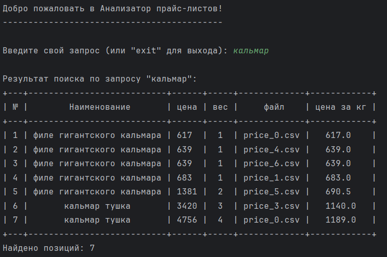

# Анализатор прайс-листов

Программа для анализа и поиска товаров в прайс-листах CSV формата.

## Описание

Анализатор прайс-листов - это инструмент для работы с прайс-листами, который позволяет:

- Загружать данные из CSV файлов
- Осуществлять поиск товаров по названию
- Отображать результаты в удобном табличном виде
- Экспортировать все данные в HTML формат

## Требования

- Python 3.6+
- prettytable

## Установка

1. Клонируйте репозиторий:

```bash
git clone https://github.com/markup-dev/price_list_analyzer.git
cd price_list_analyzer
```

2. Установите зависимости:

```bash
pip install prettytable
```

## Использование

1. Поместите CSV файлы с прайс-листами в директорию проекта. Файлы должны:
    - Иметь в названии слово "price"
    - Иметь расширение .csv
    - Содержать следующие колонки:
        - Название товара (допустимые заголовки: 'название', 'продукт', 'товар', 'наименование')
        - Цена (допустимые заголовки: 'цена', 'розница')
        - Вес/фасовка (допустимые заголовки: 'фасовка', 'масса', 'вес')

2. Запустите программу:

```bash
python project.py
```

3. Введите поисковый запрос для поиска товаров
4. Для выхода введите 'exit'

## Формат вывода

Результаты поиска отображаются в виде таблицы со следующими колонками:

- № (порядковый номер)
- Наименование товара
- Цена
- Вес
- Файл-источник
- Цена за кг

Данные отсортированы по цене за кг.

После завершения работы программа автоматически создает файл `output.html` со всеми загруженными данными.

## Обработка ошибок

Программа обрабатывает следующие ошибки:

- Отсутствие директории с файлами
- Отсутствие CSV файлов
- Пустые файлы
- Некорректный формат данных

## Пример использования


